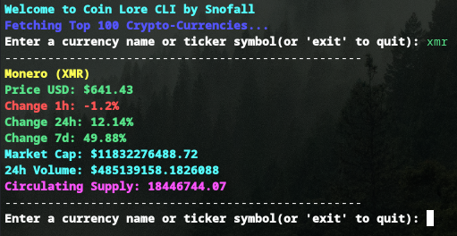

# CoinLore CLI

A simple command-line tool to search and view real-time cryptocurrency data from the [CoinLore API](https://www.coinlore.com/).

[](https://www.ruby-lang.org/)




---

## Features

- Search by **coin name** or **ticker symbol**
- Fetch live data from CoinLore `/ticker/?id=...`
- Display:
  - Price in USD
  - 1h, 24h, and 7d percentage change
  - Market cap
  - 24h volume
  - Circulating supply
- Loop to search multiple coins without restarting the CLI
- Modular, expandable, and beginner-friendly

---

## Installation

1. Clone this repository:

```bash
git clone https://github.com/ssnofall/coin-lore-cli.git
cd coin-lore-cli
bundle install
ruby coinlore.rb
```

---

## Disclaimer

> **Disclaimer:** This project is not affiliated with [CoinLore](https://www.coinlore.com/).  
> It is an independent tool that uses their public API to display cryptocurrency data in the command line.


